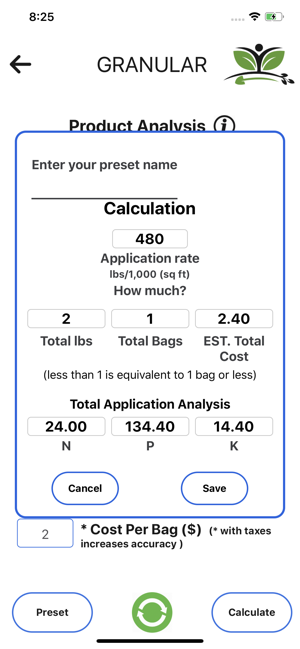
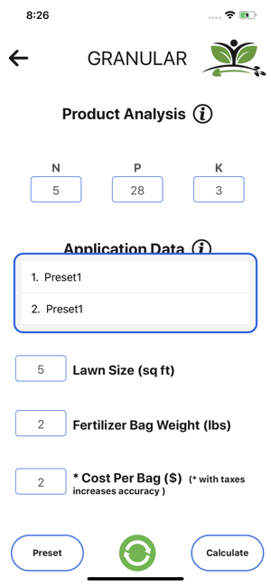
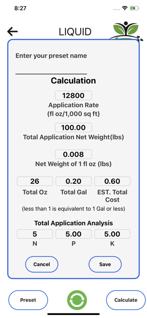
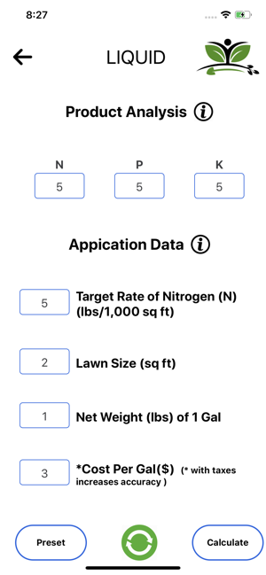
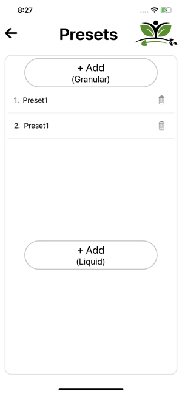
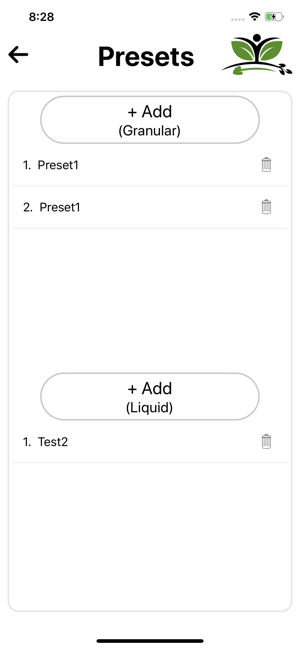
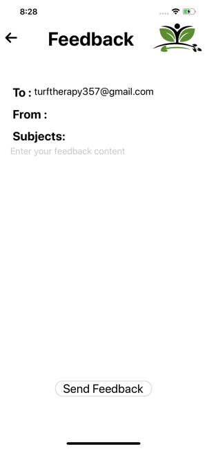
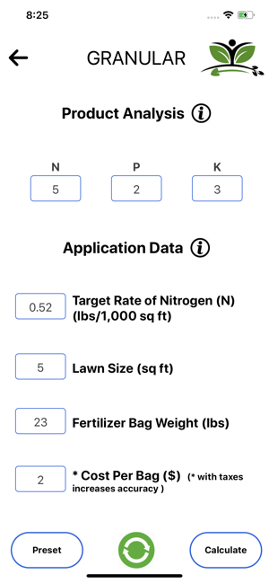

<h1 align="center"><b>  Turf Therapy App</b> </h1>

You will be able to calculate both the Granular and Liquid Fertilizer Application!

<i>"How to save a life?" -  Turf Therapy</i> 

  
  
  
  

  <a href="#blush-overview">Overview</a> •
  <a href="#dizzy-roadmap">Roadmap</a> •
  <a href="#wrench-install-instructions">Install</a> •
  <a href="#zap-tech-stack">Tech Stack</a> •
  <a href="#iphone-Test">Test</a> •
  <a href="#eyes-version">Version</a> •

  <kbd>
    
  </kbd>
  &nbsp;&nbsp;&nbsp;&nbsp;
  <kbd>
    
  </kbd>
  &nbsp;&nbsp;&nbsp;&nbsp;
  <kbd>
    
  </kbd>
    
  <kbd>
    
  </kbd>
    &nbsp;&nbsp;&nbsp;&nbsp;
  <kbd>
    
  </kbd>
    &nbsp;&nbsp;&nbsp;&nbsp;
  <kbd>
    
  </kbd>
    
  <kbd>
    
  </kbd>
    &nbsp;&nbsp;&nbsp;&nbsp;
  <kbd>
    
  </kbd>
    &nbsp;&nbsp;&nbsp;&nbsp;
  <kbd>
    
  </kbd>

## :blush: **Overview?**

With the Turf Therapy App you will be able to calculate both the Granular and Liquid Fertilizer Application Rates of Nitrogen (N), Phosphorous (P), and Potassium (K) at a rate of "lbs per 1,000 sq ft" with ease. 

Say good bye to the long, drawn out, mind numbing math! It was my mission to streamline calculating fertilizer application rates, and to make it a pleasant user friendly experience. 

The Turf Therapy App can be used by Lawn care enthusiasts looking to advance their lawn care skills, and Small business owners looking for an easy way to train staff or calculate quotes. 

I hope you enjoy and don't forget to rate the app please! Send feedback for desired new features or technical difficulties.

*Disclaimer Turf Therapy does NOT accept responsibility for any loss which may occur from reliance on the software or materials published in this application.

## :dizzy: **Roadmap**

-   [x] Make it work on IOS
-   [x] Make it work on Android
-   [x] Make it work on React-Native-Cli
-   [x] Transform into responsive
-   [x] Update to latest React Native version

## :wrench: **Install instructions**

### Getting Started

#### 1) Clone & Install Dependencies

- 1.1) `git clone https://github.com/kingofdevs/rn-turf-therapy.git`
- 1.2) `cd react-native-expo-loadpaneldriver` - cd into your newly created project directory.
- 1.3) Install NPM packages with `yarn install`
        **Note:** NPM has issues with React Native so `yarn` is recommended over `npm`.
#### 2) Start your app

- 2.1) **[EXPO]** Build and run the iOS app, run `expo run-ios` (to run on simulator) or `expo --device` (to run on real device) from the root of your project. The first build will take some time.
## :zap: **Tech Stack**

<h1 align="center">
  
  
  
   
</h1>

-   [React Native](https://github.com/facebook/react-native)
-   [Redux](https://github.com/reduxjs/react-redux)
-   [Redux-Persist](https://github.com/rt2zz/redux-persist)
-   [Antd Mobile RN](https://github.com/ant-design/ant-design-mobile-rn)
-   [React Native Firebase](https://github.com/invertase/react-native-firebase)
-   [Eslint](https://eslint.org/)

## :iphone: **Test**

- [x] Test on Android
- [x] Test on iOS

## :eyes: **Version**
- [x] React-Native 0.61.5 
- [ ] Expo 36
